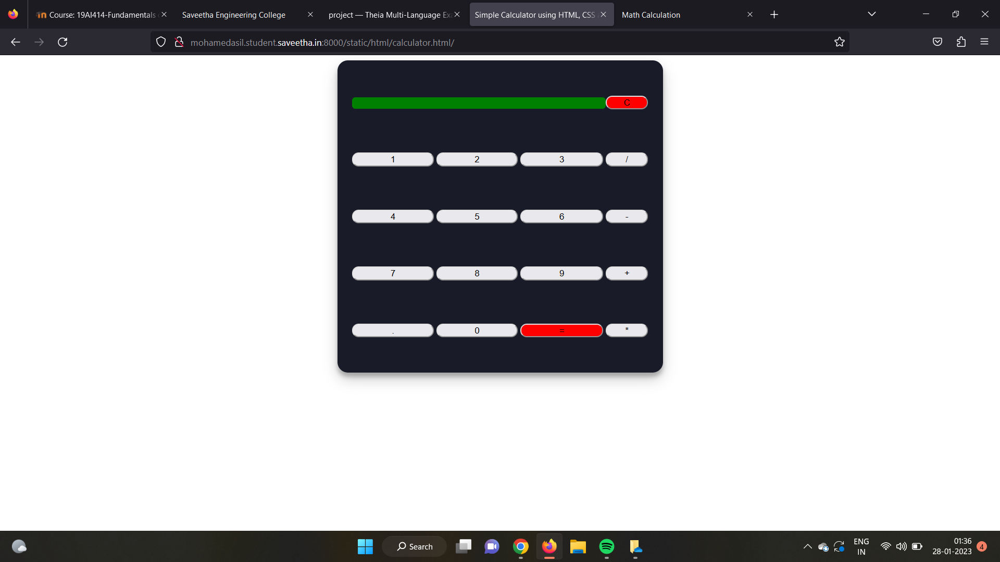

# Design of a Standard Calculator

## AIM:

To design a web application for a standard calculator.

## DESIGN STEPS:

Step 1:
Clone the github repository and create Django admin interface.

Step 2:
Change settings.py file to allow request from all hosts.

Step 3:
Use CSS for creating attractive colors.

Step 4:
Write JavaScript program for implementing five different operations

Step 5:
Validate the HTML and CSS code.

Step 6:
Validate the HTML and CSS code.

## PROGRAM :
```
<!DOCTYPE html>
<html>
	<head>
		<title>Online Calculator</title>
		<script>
			function number(value){
				document.form1.result.value += value;
			}
			function cle(value) {
				document.form1.result.value=0;
			}
			function evalua() {
				//var evalu=eval(document.form1.result.value);
				document.form1.result.value=eval(document.form1.result.value);
			}
		</script>
		<style>
			table{
				border: 2px solid black;
				width:30%;
				
				
			}
			
			td{
				padding: 25px;
				width:25px;

				height:125%;
				color:rgb(0, 234, 255);
			}
			button{
				width:100%;
				height: 50px;
				color:rgb(255, 0, 0);
                background-color: rgba(0, 110, 255, 0.486);
				
			}
            
			input{
				width:100%;
				height:20px;
				background-color:rgb(255, 255, 255);
			}
			
			button:hover{
				background-color:rgb(255, 0, 251);
				color:black;
				font-weight:bold;
			}
			table{
 background-color: darkblue;
			}
		</style>
	</head>
	<body>
		<form name="form1">
			<table align="center">
				<tr><td colspan="4" style="text-align:center">SIMPLE CALCULATOR</td></tr>
				<tr><td colspan="4">
					<input type="text" name="result" placeholder="0" disabled style="text-align:right"></input>
					</td>
				</tr>
				<tr>
					<td><button type="button" onclick="number(value)" value="1">1</button></td>
					<td><button type="button" onclick="number(value)" value="2">2</button></td>
					<td><button type="button" onclick="number(value)" value="3">3</button></td>
					<td><button type="button" onclick="number(value)" value="+">+</button></td>
				</tr>
				<tr>
					<td><button type="button" onclick="number(value)" value="4">4</button></td>
					<td><button type="button" onclick="number(value)" value="5">5</button></td>
					<td><button type="button" onclick="number(value)" value="6">6</button></td>
					<td><button type="button" onclick="number(value)" value="-">-</button></td>
				</tr>
				<tr>
					<td><button type="button" onclick="number(value)" value="7">7</button></td>
					<td><button type="button" onclick="number(value)" value="8">8</button></td>
					<td><button type="button" onclick="number(value)" value="9">9</button></td>
					<td><button type="button" onclick="number(value)" value="/">/</button></td>
				</tr>
				<tr>
					<td><button type="button" onclick="number(value)" value="."><strong>.</strong></button></td>
					<td><button type="button" onclick="number(value)" value="0">0</button></td>
					<td><button type="button" onclick="number(value)" value="*">*</button></td>
					<td><button type="button" onclick="number(value)" value="%">%</button></td>
				</tr>
				<tr>
					<td colspan="2"><button type="button" onclick="cle(value)" value="C">C</button></td>
					<td colspan="2"><button type="button" onclick="evalua()" value='='>= </button></td>
				</tr>
			</table>
		</form>
	</body>
</html>
```
## OUTPUT:

## Result:
the output for calculator is displayed successfully


